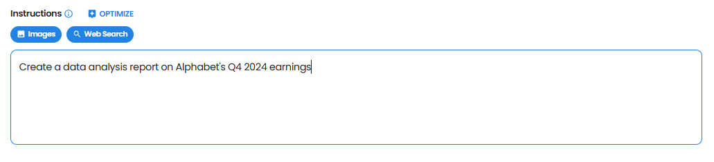
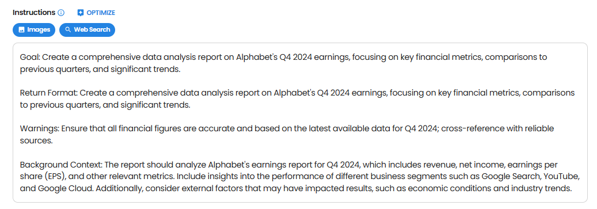
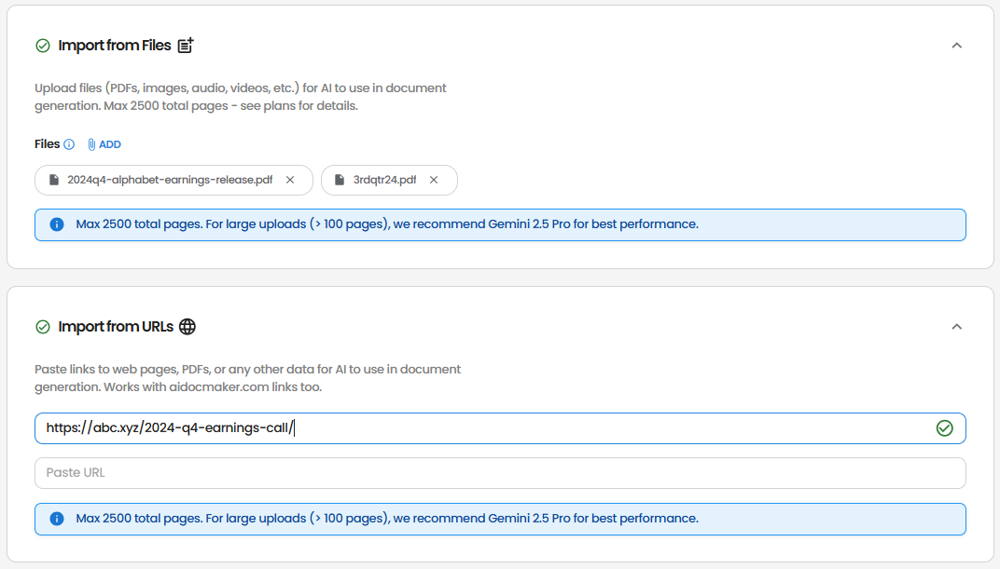
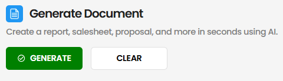
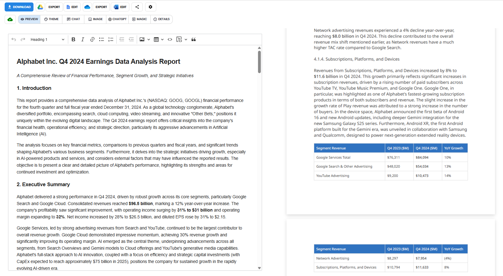

This example demonstrates how to create a comprehensive data analysis report for Alphabet's Q4 2024 earnings using Aidocmaker.com.

### Step 1: Select AI Model
Choose an AI Model of choice, but Auto Mode is recommended

### Step 2: Optional Background Information
Provide background infomation such as facts or details for higher quality writing. 

### Step 3: Instructions
Provide the instructions to generate the document

- Type the instructions 

Create data analysis report on Alphabet's Q4 Earnings

- Use <b>Optimize</b> button to optimize the instructions

AI optimized instructions

- <b>Optional:</b> You can also turn off <b>images</b> and <b>web search</b> capabilities if you want the report to be generated without external images or web data.

### Step 4: Reference Materials
Upload the following files:
- Alphabet's Q4 2024 earnings
- Previous quarter's financial statements

Add the following URLs:
- Alphabet's 2024 Q4 earnings release press

### Step 5: Generate!

The generated report will be a professional-grade financial analysis document that includes:

- Clean, professional formatting
- Data visualizations
- Comparative analysis
- Actionable insights
- Professional financial terminology

Try generating your own financial analysis report on [Aidocmaker.com](https://www.aidocmaker.com)!
