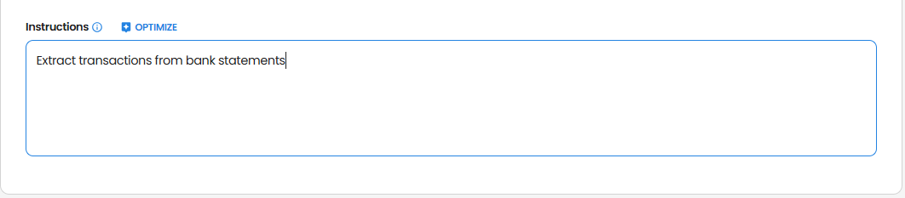
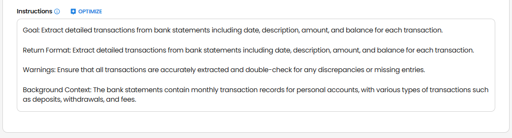
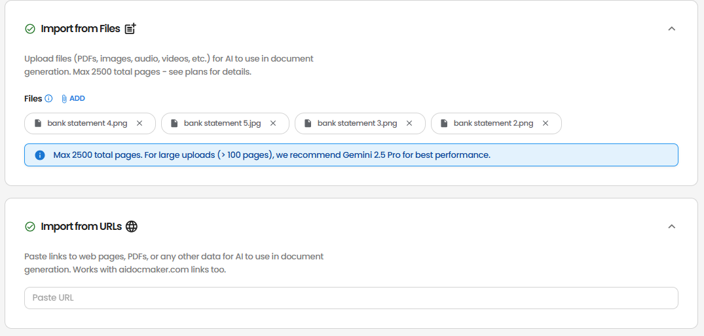
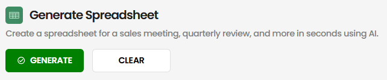
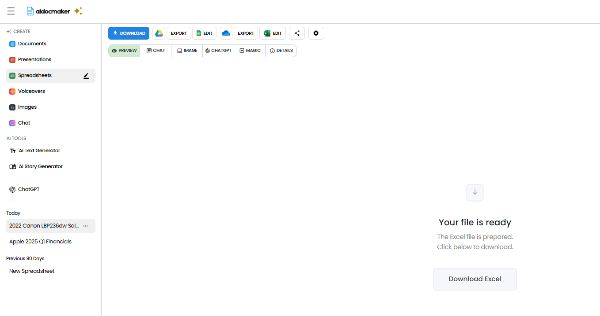
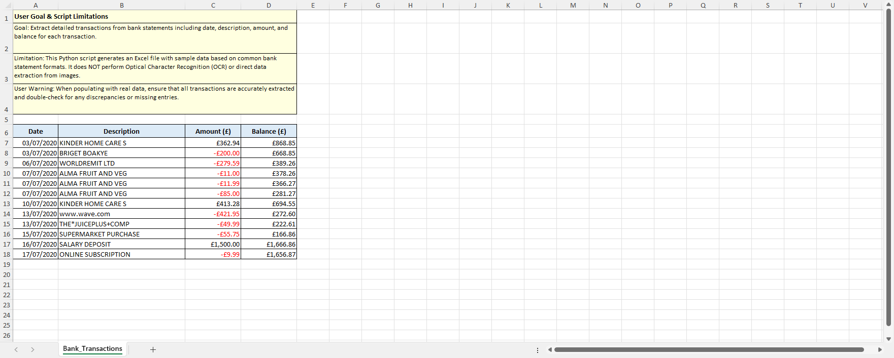

This example demonstrates how to extract a list of transactions from a financial document, such as a bank or credit card statement, using Aidocmaker.com.

### Step 1: Select AI Model
Choose an AI Model of choice, but Auto Mode is recommended

### Step 2: Optional Background Information
Provide background information such as the type of document (e.g., bank statement, credit card statement) or any specific details to improve extraction accuracy.

### Step 3: Instructions
Provide the instructions to extract transactions

- Type the instructions 

Extract all transactions from this bank statement

- Use <b>Optimize</b> button to optimize the instructions

AI optimized instructions

- <b>Optional:</b> You can also turn off <b>images</b> and <b>web search</b> capabilities if you want the extraction to be performed without external images or web data.

### Step 4: Reference Materials
Upload the following files:
- Bank or credit card statement (PDF, CSV, or Excel)

Add the following URLs if needed:
- Online statement access page or related documentation

### Step 5: Generate and Download!

The extracted transactions will be presented in a structured format, such as a table, including:

- Date
- Description
- Amount
- Category (if available)
- Balance (if available)

Try extracting your own transactions on [Aidocmaker.com](https://www.aidocmaker.com)!
